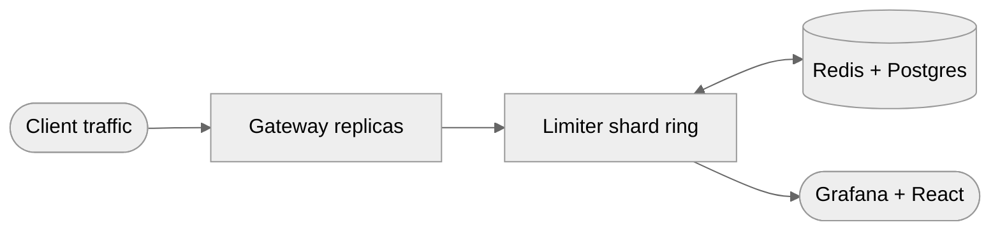

<div align="center">

# Distributed Rate Limiter & API Gateway

**Multi-tenant gateway · token-bucket and sliding-window quotas · consistent-hash shard ring · Raft election over shard failure**


[Case study](https://www.shivamsfolio.com/projects/distributed-rate-limiter-api-gateway) · [Claims ledger](CLAIMS.md) · [Series](#part-of-a-series)

</div>

---

> [!IMPORTANT]
> **0 of 9 milestones complete.** There is working code below, but no milestone has passed its verification step yet — see [what runs today](#run-what-exists-today) for exactly what does and does not exist. `45K req/s · <8ms p99` is a target, not a measurement; nothing is benchmarked yet. Every number lands in [CLAIMS.md](CLAIMS.md) first, with its commit, host and caveat.

## Problem

Keep per-tenant quotas accurate across replicas while a noisy neighbour, a lost shard or a rebalance is in progress.

## Run what exists today

Working code, but not yet a milestone. What exists: an in-memory token bucket, an in-memory
sliding-window log, a Redis-backed token bucket driven by one atomic Lua script, and HTTP
middleware that returns 429 with `Retry-After`.

What the milestones below still ask for and this does **not** have: the `--node` / `--config`
flags and `configs/local.yaml` the case study advertises, a `/v1/check` endpoint, a Redis
sliding window, Redis `TIME` as the clock source (today's script is handed the *gateway's*
clock, which drifts between replicas), a policy store, and CI.

Tests need no containers — the Redis-backed limiter is covered by an in-process fake:

```bash
go test ./...                                                   # tests
go run ./cmd/gateway                                            # in-memory limiter, per-replica counts
docker compose up -d redis && RATE_LIMIT_BACKEND=redis REDIS_ADDR=localhost:6379 go run ./cmd/gateway
docker compose up --build                                       # whole stack
```

On PowerShell, set the environment first — it has no inline env-var prefix:

```powershell
$env:RATE_LIMIT_BACKEND = "redis"; $env:REDIS_ADDR = "localhost:6379"; go run ./cmd/gateway
```

| Variable | Default | Meaning |
|---|---|---|
| `GATEWAY_ADDR` | `:8080` | listen address |
| `RATE_LIMIT_BACKEND` | `memory` | `memory` or `redis` |
| `RATE_LIMIT_ALGORITHM` | `token_bucket` | `token_bucket` or `sliding_window` (memory backend only) |
| `REDIS_ADDR` | `localhost:6379` | Redis address (redis backend only) |
| `RATE_LIMIT_CAPACITY` | `20` | token bucket burst size |
| `RATE_LIMIT_REFILL_PER_SEC` | `5` | token bucket steady-state rate |
| `RATE_LIMIT_MAX_REQUESTS` | `20` | sliding window: max requests per window |

## Architecture



| Stage | | Detail |
|---|---|---|
| **Client traffic** | `in` | REST / gRPC |
| **Gateway replicas** | `work` | auth · routing · policy · proxy |
| **Limiter shard ring** | `work` | consistent hashing with virtual nodes · Raft over membership |
| **Redis + Postgres** | `state` | atomic Lua counters · tenant policies |
| **Grafana + React** | `out` | RED metrics · live per-tenant headroom |

Raft governs **membership and ring ownership only**, never per-request counters — per-request consensus would destroy the latency budget. The consequence is stated rather than hidden: quota is not strictly consistent across a rebalance window.

## Scope

**Dual limiting strategies.** Token-bucket for smooth burst control, sliding-window counters for stricter endpoint policies. Both are single-round-trip atomic Lua, so two gateway processes sharing one Redis enforce one quota, not two.

**Resilient control plane.** Consistent-hash sharding keeps a tenant on a stable shard; Raft promotes a replacement leader on failure, with quota accuracy preserved across the rebalance.

**Observable delivery.** gRPC and REST expose decisions and quota status; Prometheus feeds Grafana and a live React dashboard.

## Roadmap

`[░░░░░░░░░░░░░░░░░░░░░░░░] 0/9` — ticked only when the verification step passes, not when the code is written.

- [ ] **M1 · Skeleton, config, single-node token bucket that says 429** — one process enforces an in-memory per-tenant bucket over REST, on the advertised config path and flags.
- [ ] **M2 · Redis-backed token bucket and sliding window** — both strategies as single-round-trip atomic Lua; two processes sharing one Redis enforce one quota.
- [ ] **M3 · Postgres policy store, tenant auth, hot-reloading cache** — per-tenant and per-endpoint policies in Postgres, served from an in-process cache; `make migrate` works as advertised.
- [ ] **M4 · gRPC contract and the actual gateway data path** — authenticates, routes, applies policy and proxies upstream; same decisions over gRPC.
- [ ] **M5 · Consistent-hash ring with cross-node forwarding** — a tenant always lands on the same shard; a node that does not own it forwards over gRPC.
- [ ] **M6 · Raft membership and leader election** — ring ownership survives a node dying; enforcement continues with quota accuracy across the rebalance.
- [ ] **M7 · Prometheus, Grafana, live React dashboard** — every decision observable; per-tenant headroom exactly as advertised.
- [ ] **M8 · Benchmark harness and honest tuning** — a defensible throughput and p99 on real hardware, methodology written down, or the claim corrected.
- [ ] **M9 · AKS deployment and chaos under load** — the whole stack on AKS, surviving a pod deletion mid-load.

The benchmark needs a **separate Linux load-generation host**: k6 runs a JS VM per VU and will steal the cores it is measuring, and the figure is an aggregate across 3–4 replicas, not per-replica. Both go in the report or the number is doing work it did not earn.

## Stack

`Go 1.23+` `gRPC (buf + protoc-gen-go-grpc)` `chi` `Redis 7 (Lua, go-redis v9)` `PostgreSQL 16 (pgx + golang-migrate)` `hashicorp/raft + raft-boltdb` `consistent hashing with virtual nodes` `Prometheus + Grafana` `React 18 + Vite + TypeScript` `Docker Compose` `Kubernetes + AKS + ACR (Helm)` `k6 (constant-arrival-rate) + wrk2` `GitHub Actions`

## Commands

Beyond what runs today, the shape the finished project is aiming for:

```bash
docker compose up -d redis postgres && make migrate                     # 1. data plane
go run ./cmd/gateway --node gateway-1 --config ./configs/local.yaml     # 2. a shard
cd dashboard && npm install && npm run dev                              # 3. dashboard
k6 run tests/rate-limit.js && kubectl get pods -n gateway               # 4. the envelope
```

## Part of a series

Seven systems projects, built one at a time. This is **#2**.

| # | Project | Repo |
|---|---|---|
| 01 | Low-Latency Market Data & Order Entry Stack | [`low-latency-market-data-stack`](https://github.com/Git-ShivamPatil/low-latency-market-data-stack) |
| 02 | **Distributed Rate Limiter & API Gateway** *(you are here)* | — |
| 03 | Agentic AI Orchestration Platform | [`agentic-orchestration-platform`](https://github.com/Git-ShivamPatil/agentic-orchestration-platform) |
| 04 | High-Performance LLM Inference Server | [`rust-llm-inference-server`](https://github.com/Git-ShivamPatil/rust-llm-inference-server) |
| 05 | Secure Banking System | [`fabric-banking-platform`](https://github.com/Git-ShivamPatil/fabric-banking-platform) |
| 06 | Online Examination System | [`online-examination-system`](https://github.com/Git-ShivamPatil/online-examination-system) |
| 07 | Secure RAG with RBAC, Guardrails & Monitoring | [`secure-rag-rbac`](https://github.com/Git-ShivamPatil/secure-rag-rbac) |

Plus [`bfsi-lending-lakehouse`](https://github.com/Git-ShivamPatil/bfsi-lending-lakehouse) — a medallion lakehouse shipped outside the series. All published on [shivamsfolio.com](https://www.shivamsfolio.com/projects).

## Licence

[MIT](LICENSE) © Shivam Patil

---

<div align="center">

**[Case study](https://www.shivamsfolio.com/projects/distributed-rate-limiter-api-gateway)** · **[All projects](https://www.shivamsfolio.com/projects)** · **[Contact](https://www.shivamsfolio.com/contact)**

</div>
