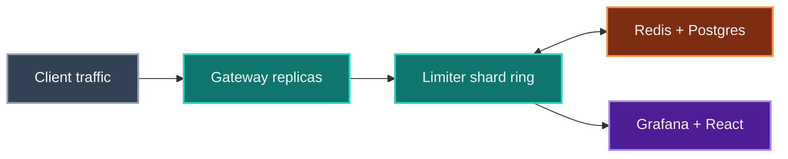

<div align="center">

# Distributed Rate Limiter & API Gateway

**Multi-tenant API gateway: token-bucket and sliding-window quotas across a consistent-hash shard ring, with Raft election covering shard failure.**


   

[Case study](https://www.shivamsfolio.com/projects/distributed-rate-limiter-api-gateway) · [Claims ledger](CLAIMS.md) · [All 7 projects](#part-of-a-series)

</div>

---

> [!IMPORTANT]
> **This is a build in progress — 3 of 9 milestones complete.**
>
> The target figure below (`45K req/s · <8ms p99`) is a **goal, not a measurement.** Nothing here has been benchmarked yet.
> Every number this project eventually publishes will land in [CLAIMS.md](CLAIMS.md) first, with the commit it was measured at,
> the hardware it ran on, and the caveat that matters. If it is not in that file, it has not been measured.

## The problem

Keep per-tenant quotas accurate across replicas and regions while a noisy neighbour, a lost shard or a region blip is in progress.

## How it fits together



| Stage | | What it does |
|---|---|---|
| **Client traffic** | `in` | REST / gRPC |
| **Gateway replicas** | `work` | auth · routing · policy |
| **Limiter shard ring** | `work` | hashing · Raft |
| **Redis + Postgres** | `state` | counters · policies |
| **Grafana + React** | `out` | metrics · quotas |

<sub>Conceptual architecture. Colour carries meaning, and it means the same thing across all seven projects in this series: **grey** is what comes in, **teal** is where the work happens, **amber** is state that outlives a request, **violet** is what comes out.</sub>

## What is being built

**Dual limiting strategies.** Token-bucket for smooth burst control and sliding-window counters for stricter endpoint policies.

**Resilient control plane.** Consistent-hash sharding keeps a tenant on a stable limiter shard; Raft election promotes a replacement leader on failure.

**Observable delivery.** gRPC and REST APIs expose decisions and quota status, while Prometheus metrics feed Grafana and a live React dashboard.

## Running what exists today

This is the one project in the series with working code already. The three items ticked in the roadmap below run today.

Run the tests — the Redis-backed limiter is covered by an in-process fake, so this needs no containers:

```bash
go test ./...
```

Start the gateway with the in-memory limiter (each replica counts on its own):

```bash
go run ./cmd/gateway
```

Start it against Redis, so every replica shares one bucket per client:

```bash
docker compose up -d redis
RATE_LIMIT_BACKEND=redis REDIS_ADDR=localhost:6379 go run ./cmd/gateway
```

On Windows PowerShell, set the environment first — it has no inline env-var prefix:

```powershell
$env:RATE_LIMIT_BACKEND = "redis"
$env:REDIS_ADDR = "localhost:6379"
go run ./cmd/gateway
```

Or bring the whole stack up in containers:

```bash
docker compose up --build
```

### Configuration

| Variable | Default | Meaning |
|---|---|---|
| `GATEWAY_ADDR` | `:8080` | listen address |
| `RATE_LIMIT_BACKEND` | `memory` | `memory` or `redis` |
| `RATE_LIMIT_ALGORITHM` | `token_bucket` | `token_bucket` or `sliding_window` (memory backend only) |
| `REDIS_ADDR` | `localhost:6379` | Redis address (redis backend only) |
| `RATE_LIMIT_CAPACITY` | `20` | token bucket burst size |
| `RATE_LIMIT_REFILL_PER_SEC` | `5` | token bucket steady-state rate |
| `RATE_LIMIT_MAX_REQUESTS` | `20` | sliding window: max requests per window |

## Roadmap

Each milestone is independently demoable and ends in a commit. A box is ticked only when its verification step actually passed — not when the code was written.

```
[████████░░░░░░░░░░░░░░░░] 3/9 milestones · 33%
```

- [x] **M1 · Skeleton, config, and a single-node token bucket that says 429** ✅  
  One `go run ./cmd/gateway` process enforces an in-memory per-tenant token bucket over REST, using exactly the config path and flags the portfolio page advertises.
- [x] **M2 · Redis-backed token bucket AND sliding window, atomic and shared** ✅  
  Both advertised limiting strategies run as single-round-trip atomic Lua scripts against Redis, so two gateway processes sharing one Redis enforce ONE quota, not two.
- [x] **M3 · Postgres policy store, tenant auth, and hot-reloading cache** ✅  
  Per-tenant and per-endpoint policies live in Postgres, are served from an in-process cache, and `make migrate` works as advertised.
- [ ] **M4 · gRPC contract plus the actual gateway data path**  
  The thing is a gateway, not just a limiter: it authenticates, routes, applies policy, and proxies to an upstream — and exposes the same decisions over gRPC.
- [ ] **M5 · Consistent-hash shard ring with cross-node forwarding**  
  A tenant always lands on the same limiter shard, and a node that does not own a tenant forwards the check to the node that does, over gRPC.
- [ ] **M6 · Raft membership and leader election over the ring**  
  Ring membership and shard ownership survive a node dying — a new leader is elected and enforcement continues, with quota accuracy preserved across the rebalance.
- [ ] **M7 · Prometheus metrics, Grafana boards, and the live React dashboard**  
  Every decision is observable — RED metrics scrape into Prometheus and Grafana, and the React dashboard shows live per-tenant quota headroom exactly as the page advertises.
- [ ] **M8 · Benchmark harness and honest tuning to the advertised envelope**  
  Produce a defensible throughput and p99 number on real hardware, with the methodology written down, and tune until the envelope is met or the claim is corrected.
- [ ] **M9 · AKS deployment, chaos under load, and docs**  
  The whole stack runs on AKS with the advertised `kubectl get pods -n gateway` actually meaning something, and survives a pod deletion while under load.

## On the performance target

| | |
|---|---|
| **Target** | `45K req/s · <8ms p99` |
| **Measured so far** | nothing — see [CLAIMS.md](CLAIMS.md) |
| **Feasibility** | `yes-with-specific-hardware` |

<details>
<summary><b>What it would actually take to hit this honestly</b></summary>

Reachable, but not on the builder's machine and not without stating the cluster shape. What the number actually requires: (1) Linux, not Docker Desktop on Windows 10 — the WSL2 NAT path adds latency and caps small-request throughput well below target, so both the SUT and the load generator must run on Linux hosts. (2) A SEPARATE load-generation host. k6 is expensive (a JS VM per VU) and will steal the cores it is measuring; co-locating k6 with the gateway is the single most common way this number becomes fiction. Two Standard_D8s_v5 Azure VMs in one VNet with proximity placement, or a D8s_v5 SUT and a Linux box on the same LAN, is the minimum honest rig. (3) k6's constant-arrival-rate executor with a p99 threshold that fails the run — ramping-vus plus eyeballed percentiles suffers coordinated omission and will flatter the tail by an order of magnitude. Cross-check with wrk2, which was built specifically to correct for it. (4) Aggregate, not per-replica: expect roughly 12-20K req/s per gateway replica on 8 cores for a decision-only path with keep-alive connections and small payloads, so 45K means 3-4 replicas. That is a legitimate distributed-systems number, but the page says '45K req/s' with no shape, so BENCHMARKS.md has to state the replica count or the line is doing work it did not earn. (5) Redis must not be the wall — a single Redis instance does roughly 80-120K cheap EVALs/sec single-threaded, so 45K single-round-trip checks fits with headroom, but only if the Lua script is one round trip and connections are pooled; the moment a check costs two round trips you need to shard Redis. (6) The <8ms p99 is the EASIER half in-datacenter — 8ms is generous for a Go proxy plus one Redis hop (expect p99 in the 1-4ms range at moderate load) — but it collapses if a check crosses the ring to a remote shard on a cold connection, or if the benchmark proxies to a real backend rather than a stub. Decide and disclose which path was measured: the Check decision path, or full proxying to cmd/echo. (7) The number must NOT be measured while any request crosses a region — Raft or forwarding across Azure regions is 30-80ms RTT and blows the budget by an order of magnitude on its own.

</details>

## Stack

- Go 1.23+
- gRPC (buf + protoc-gen-go-grpc)
- REST (chi)
- Redis 7 (Lua scripts, redis/go-redis v9)
- PostgreSQL 16 (pgx + golang-migrate)
- hashicorp/raft + raft-boltdb
- Consistent hashing with virtual nodes
- Prometheus + Grafana
- React 18 + Vite + TypeScript (dashboard)
- Docker / Docker Compose
- Kubernetes + Azure AKS + ACR (Helm)
- k6 (constant-arrival-rate) with wrk2 cross-check
- GitHub Actions

## How it will be run

Beyond what works today, this is the shape the finished project is aiming for:

**1. Bring up the data plane.** Start Redis and PostgreSQL locally; apply the tenant-policy schema before launching the gateway.

```bash
docker compose up -d redis postgres
make migrate
```

**2. Start a shard.** Run a gateway replica with the desired node identity and consistent-hash ring configuration.

```bash
go run ./cmd/gateway --node gateway-1 --config ./configs/local.yaml
```

**3. Attach the dashboard.** Install the dashboard dependencies and point it at the REST metrics endpoint.

```bash
cd dashboard && npm install && npm run dev
```

**4. Prove the envelope.** Exercise both a burst and sustained-load profile, then inspect p99 latency and rejected requests.

```bash
k6 run tests/rate-limit.js
kubectl get pods -n gateway
```

<details>
<summary><b>Planned repository layout</b></summary>

```
cmd/gateway/
cmd/echo/
cmd/gatewayctl/
internal/limiter/ (tokenbucket.go, slidingwindow.go, redis/*.lua)
internal/ring/
internal/cluster/ (hashicorp/raft FSM, membership)
internal/gateway/ (router, proxy, middleware, auth)
internal/policy/ (pgx repository + cache)
internal/telemetry/
api/proto/ratelimit/v1/
api/openapi.yaml
buf.yaml + buf.gen.yaml
configs/local.yaml
configs/cluster-3node.yaml
migrations/
dashboard/ (Vite + React + TS)
deploy/helm/
deploy/k8s/
deploy/grafana/
tests/rate-limit.js
tests/burst.js
tests/sustained.js
scripts/ (cluster-up.sh, kill-leader.sh, dual-node-quota.sh, chaos-delete-pod.sh, bench-provision.sh)
docker-compose.yml
Makefile
BENCHMARKS.md
docs/architecture.md
README.md
.github/workflows/ci.yml
.golangci.yml
```

</details>

<details>
<summary><b>Known risks going in</b></summary>

Written before a line of code, so they can be checked against what actually happened.

- SUBSTANTIATION RISK — the headline number. '45K req/s · <8ms p99' is already public with no hardware, no cluster shape and no methodology attached. If it ends up measured on loopback, with k6 on the same box, against a stub upstream, on the decision-only path, then the honest version of the sentence is much narrower than what the page implies. Mitigation: BENCHMARKS.md must record VM SKU, core count, replica count, Redis topology, payload size, executor type and upstream type, and the portfolio line should be amended to match if the rig cannot produce the number cleanly.
- SUBSTANTIATION RISK — 'across replicas and regions'. The useCase claims multi-region and the summary claims 'a region blip'. Multi-region is the one claim here that is both expensive to prove (two AKS clusters plus cross-region egress) and architecturally in tension with the latency claim, since Raft across regions is 30-80ms RTT. Either demonstrate it explicitly as a degraded, documented mode (regional independence with async policy replication, NOT synchronous cross-region Raft) or soften the wording to 'across replicas and availability zones'.
- SUBSTANTIATION RISK — what Raft actually governs. The correct design puts Raft over membership and ring ownership only, never over per-request counters, because per-request consensus would destroy the 8ms budget. That is defensible and matches the page's 'Raft election covering shard failure' — but it means the system is NOT strictly consistent for quota during a rebalance window. Be able to state that limitation out loud; over-claiming consistency here is the most likely way this project fails a systems interview it otherwise passes.
- Docker Desktop / WSL2 gives misleading local numbers throughout development, causing tuning against a phantom bottleneck for entire sessions before the separate Linux load-gen host is set up. Get the benchmark rig standing at M8 start, not at M8 end.
- Failover races producing over-admission (two shards briefly both owning a tenant during rebalance) or dropped quota. These reproduce intermittently under load only, are not accelerated by AI pairing, and can eat an unbudgeted session or two each. Mitigation: the M6 failover test must assert total allowed <= quota across the transition, and be run with -count=20.
- Clock-source bugs: any limiter that reads gateway wall-clock time instead of Redis TIME passes every local test and then produces wrong sliding-window results on AKS where node clocks drift. Fix it at M2, not after it bites in M9.
- Azure cost drift — an AKS cluster left running overnight is roughly $14/day, and the Standard Load Balancer plus egress add to it. Create and destroy per session, and set a budget alert before the first cluster.
- Scope creep from the seed's own words: 'auth · routing · policy' on the gateway node invites building a full auth server. Keep it to API-key and HS256/JWT validation against the policy store; anything more is a different project.
- The React dashboard is the easiest thing to over-build and the least defensible per hour spent. Cap it at the three views the page actually promises — live decisions, per-tenant quota headroom, and ring/leader state.

**Hardest part:** Milestone 8 — producing the advertised 45K req/s at sub-8ms p99 in a way you would defend in an interview. It is the one milestone with no natural stopping condition: you cannot declare it done until a number appears, and every attempt is a provision-load-measure-profile-change-remeasure loop that Claude Code cannot compress, because the bottleneck is physics and cloud provisioning, not code volume. It is also uniquely prone to false progress on Windows — Docker Desktop's WSL2 NAT will cap you around 8-15K req/s with a fat latency tail regardless of how good the gateway is, so you will spend sessions optimising Go code that was never the constraint before you accept you need a separate Linux load-gen host. The close second is M6: a rebalance race that lets two shards briefly both own a tenant produces over-admission that only appears under load, roughly one run in twenty, and those bugs are debugged in wall-clock hours of instrumentation, not in prompts.

</details>

## Part of a series

Seven systems projects, built one at a time and in this order. This is **#5 of 7** to be built.

| # | Project | Repo |
|---|---|---|
| 01 | Low-Latency Market Data & Order Entry Stack | [`low-latency-market-data-stack`](https://github.com/Git-ShivamPatil/low-latency-market-data-stack) |
| 02 | **Distributed Rate Limiter & API Gateway** *(you are here)* | — |
| 03 | Agentic AI Orchestration Platform | [`agentic-orchestration-platform`](https://github.com/Git-ShivamPatil/agentic-orchestration-platform) |
| 04 | High-Performance LLM Inference Server | [`rust-llm-inference-server`](https://github.com/Git-ShivamPatil/rust-llm-inference-server) |
| 05 | Secure Banking System | [`fabric-banking-platform`](https://github.com/Git-ShivamPatil/fabric-banking-platform) |
| 06 | Online Examination System | [`online-examination-system`](https://github.com/Git-ShivamPatil/online-examination-system) |
| 07 | Secure RAG with RBAC, Guardrails & Monitoring | [`secure-rag-rbac`](https://github.com/Git-ShivamPatil/secure-rag-rbac) |

All seven are published on [shivamsfolio.com](https://www.shivamsfolio.com/projects).

## Licence

[MIT](LICENSE) © Shivam Patil

---

<div align="center">

### [shivamsfolio.com](https://www.shivamsfolio.com)

**[This project's case study](https://www.shivamsfolio.com/projects/distributed-rate-limiter-api-gateway)** · **[All 7 projects](https://www.shivamsfolio.com/projects)** · **[Get in touch](https://www.shivamsfolio.com/contact)**

<sub>Built by Shivam Patil — systems engineering, trading infrastructure, and applied AI.</sub>

</div>
